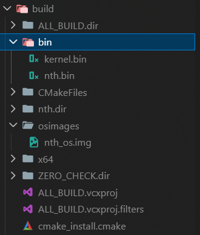
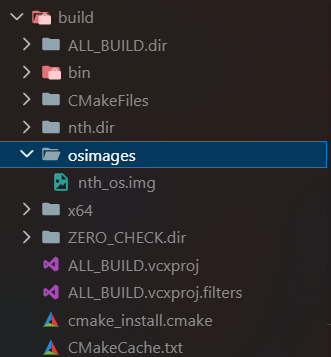
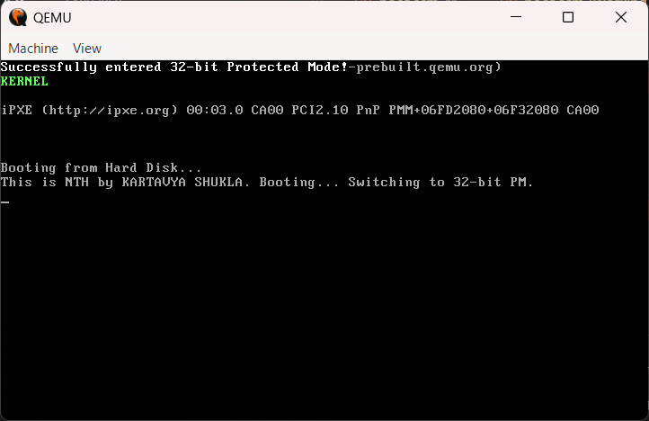

# nth

nth is an open-source bootloader.

## Setup

### Windows

> [!NOTE]
> You must have Visual Studio or the standalone **Visual C++ Build Tools** installed (specifically the "Desktop development with C++" workload) for CMake to successfully generate the build files.

```powershell
# install visual studio build tools
winget install -e --id Microsoft.VisualStudio.BuildTools --override "--passive --wait --add Microsoft.VisualStudio.Workload.VCTools --includeRecommended"

# install git (required for Git Bash and Unix utilities like dd)
winget install -e --id Git.Git

# install nasm
winget install -e --id NASM.NASM

# install qemu
winget install -e --id SoftwareFreedomConservancy.QEMU

# install cmake
winget install -e --id Kitware.CMake

```

### Linux

Run the command corresponding to your distribution. This installs NASM, QEMU, CMake, and the standard compiler toolchains (the Linux equivalent of the C++ Build Tools).

**Ubuntu / Debian**

```bash
sudo apt update
sudo apt install nasm qemu-system-x86 cmake build-essential

```

**Fedora**

```bash
sudo dnf install nasm qemu-system-x86 cmake @development-tools

```

**Arch Linux**

```bash
sudo pacman -S nasm qemu-system-x86 cmake base-devel

```

## Build Instructions

> [!TIP]
> Prebuilt images for the dummy OS can be found in the **prebuilt-images/** directory.

> Terminal / PowerShell
> ```shell
> mkdir build; cd build
> cmake ..
> cmake --build .
> 
> ```
> 
> 

Once the build process completes successfully, the compiled binaries and the final bootable disk image will be generated in the following directories:

* **Binaries:** `build/bin/` (contains individual files like `nth.bin` and `kernel.bin`)
* **OS Image:** `build/osimages/` (contains the final spliced `nth_os.img`)





## Booting

To launch the compiled operating system image using QEMU, run the following command from the root directory:

> Terminal / PowerShell
> ```shell
> qemu-system-i386 -drive format=raw,file=build/osimages/nth_os.img
> 
> ```
> 
> 


